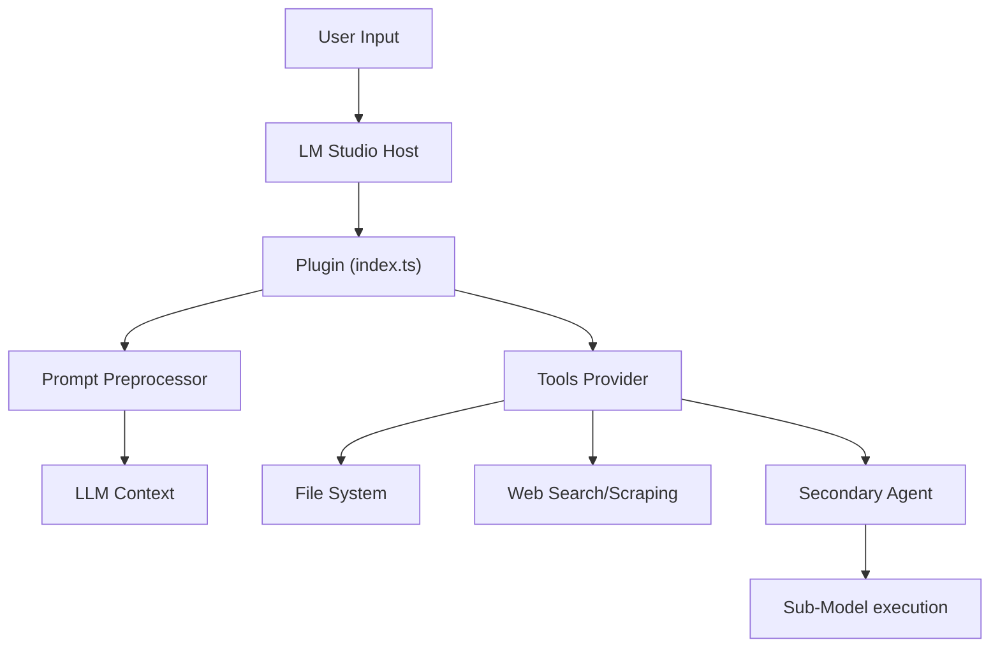

# Code Overview

This document provides a high-level overview of the `Beledarians_LM_Studio_Toolbox` codebase architecture.

## Directory Structure

The core logic resides in the `src/` directory:

- **`index.ts`**: The entry point of the plugin. It registers the configuration, tools provider, and prompt preprocessor with LM Studio.
- **`toolsProvider.ts`**: Contains the implementation of all available tools (File System, Agent, Web, Execution, etc.). This is where the main logic for tool execution resides.
- **`config.ts`**: Defines the user-configurable settings for the plugin (e.g., enabling secondary agents, safety settings).
- **`promptPreprocessor.ts`**: Handles the injection of system prompts and documentation (like `subagent_docs.md`) into the LLM's context on startup.
- **`stateManager.ts`**: Manages the state of the plugin, including sub-agent configurations and memory.
- **`toolsDocumentation.ts`**: Generates the documentation string for the tools, which is provided to the LLM so it knows how to use them.
- **`findLMStudioHome.ts`**: Utility to locate the LM Studio installation/home directory.

## Key Components

### 1. Plugin Entry Point (`index.ts`)

The `main` function in `index.ts` initializes the plugin lifecycle. It hooks into the LM Studio SDK to:

1. Load settings (`pluginConfigSchematics`).
2. Register tools (`toolsProvider`).
3. specific pre-processing logic (`promptPreprocessor`).

### 2. Tools Provider (`toolsProvider.ts`)

This is the "brain" of the plugin's capabilities. It maps the tool names (e.g., `read_file`, `consult_secondary_agent`) to their actual TypeScript implementations.

- **Security**: File system operations are sandboxed to prevent unauthorized access outside the workspace.
- **Sub-Agents**: The `consult_secondary_agent` tool orchestrates the delegation of tasks to other models.

### 3. Prompt Preprocessor (`promptPreprocessor.ts`)

Ensures the AI is aware of its capabilities and role. It reads `SUB_AGENT_INSTRUCTIONS.md` and other context files and prepends them to the conversation history when a chat starts.

## Architecture Data Flow

